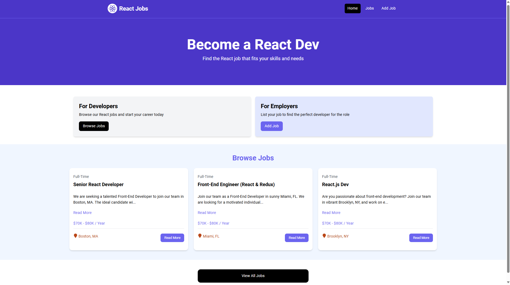
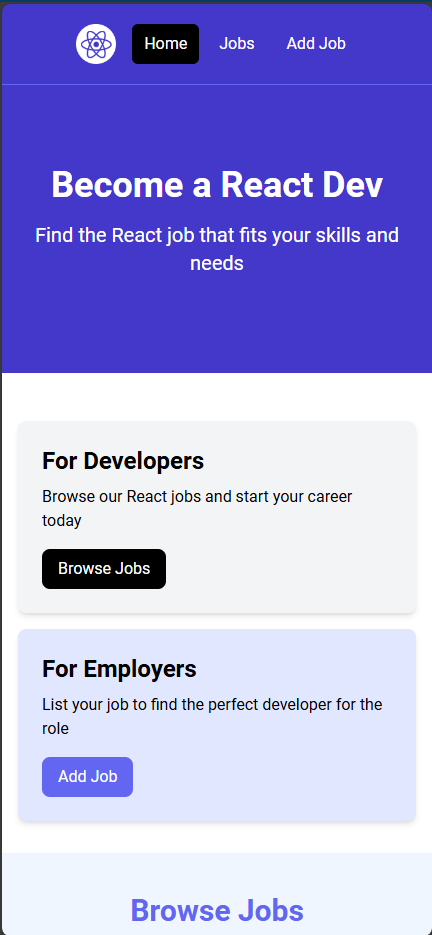

# React Jobs

A responsive and user-friendly job listing platform built with React. React Jobs allows developers to browse, add, edit, and delete job postings tailored for React developers. Leveraging modern technologies like Vite, Tailwind CSS, and React Router, the project offers a seamless experience for both job seekers and employers.

## Table of Contents

- [Introduction](#introduction)
- [Features](#features)
- [Demo](#demo)
- [Technology Stack](#technology-stack)
- [Installation](#installation)
  - [Prerequisites](#prerequisites)
  - [Steps](#steps)
- [Usage](#usage)
- [Configuration](#configuration)
- [Contributing](#contributing)
- [License](#license)
- [Contact](#contact)
- [Acknowledgements](#acknowledgements)

## Introduction

React Jobs is a web application designed to connect React developers with job opportunities tailored to their skills and preferences. Whether you're a developer looking for your next role or an employer seeking talented React professionals, React Jobs provides a streamlined platform to manage job listings efficiently.

## Features

- **Browse Jobs:** View a list of available React job postings with detailed descriptions.
- **Add Job:** Employers can create new job listings by providing necessary details.
- **Edit Job:** Modify existing job postings to update information as needed.
- **Delete Job:** Remove job listings that are no longer available.
- **Responsive Design:** Optimized for all screen sizes using Tailwind CSS.
- **Search & Filtering:** Quickly find jobs based on type, location, or salary.
- **Notifications:** Receive real-time feedback using React Toastify.
- **Loading States:** Smooth user experience with loading spinners during data fetches.

## Demo




## Technology Stack

- **Frontend:** React, Vite, React Router, Tailwind CSS
- **State Management:** React Hooks
- **Styling:** Tailwind CSS
- **Icons:** React Icons
- **Notifications:** React Toastify
- **Loading Spinners:** React Spinners
- **Deployment:** Vercel
- **Linting:** ESLint

## Installation

### Prerequisites

Ensure you have the following installed on your machine:

- **Node.js:** v14 or higher
- **npm:** v6 or higher (comes with Node.js)

### Steps

1. **Clone the Repository:**

   ```bash
   git clone https://github.com/yourusername/react-jobs.git
   ```

2. **Navigate to the Project Directory:**

   ```bash
   cd react-jobs
   ```

3. **Install Dependencies:**

   ```bash
   npm install
   ```

4. **Configure Environment Variables:**

   Create a `.env` file in the root directory if needed. For this project, the API is proxied to a mock API, so no additional environment variables are required.

5. **Run the Application:**

   ```bash
   npm run dev
   ```

   The application will be available at `http://localhost:4000`.

## Usage

### Browse Jobs

Navigate to the [Jobs Page](http://localhost:4000/jobs) to view all available job listings. You can click on individual jobs to view detailed information.

### Add a New Job

If you're an employer, go to the [Add Job Page](http://localhost:4000/add-job) to create a new job listing. Fill in the required fields and submit the form to publish your job.

### Edit or Delete a Job

On the job detail page, you can choose to edit or delete the job listing. Editing allows you to update job information, while deleting removes the job from the listings.

## Configuration

### Vite Configuration

The `vite.config.js` file sets up the development server and proxies API requests to the mock API.
